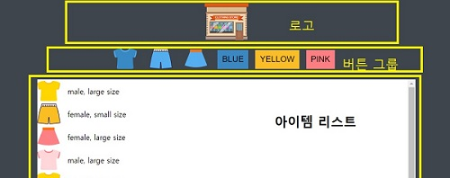

# 드림코딩 앨리 쇼핑몰 만들기   
`공부 기간: 22. 02. 04  ~ 22. 02. 07`

### 1. HTML 구조 만들기
  

- LOGO section
```html
      
```
- BtnGroup section
```html
    <button class="btn">
        
    </button>
```
- Item List section
```html
    <ul class="list">
        <!-- li 태그는 자바스크립트를 활용하여 동적 추가,, 아래 태그는 예시입니다. -->
        <li>
            
            <span> 성별, 사이즈 </span> <!-- 성별 및 사이즈는 data.json 파일의 값에서 참조-->
        </li>
        ...
        ..
        .
    </ul>
```
<br>  

---  
<br>  

### 2. CSS 꾸미기
- 가상 클래스 ( :root )  
-:root 선택자는 웹 문서 구조에서 가장 상위 요소를 선택할 때 사용한다.  
-:root → html  
-재사용빈도가 높은 속성 값을 사용할 때 편리하며, 반응형 웹/앱을 제작할 때 값 관리가 용이하다. 
``` css 
    :root {
        /* color 외 size, margin, transition 값 관리 */
        --color-black: #3f454d;
        --color-white: #ffffff;
        --color-blue: #3b88c3;
        /* --color-색상 (변수): #?????? (값) */
    }

    .container {
        background-color: var(--color-black);
        /* 변수 사용 시 var(변수) */
    }

```
- 반응형 뷰포트
``` css
    .container {
        width: 100vh; /* px로 설정하는 것이 아닌 뷰포트의 비율로 너비 or 높이 설정*/
    }
```  
- 애니메이션 효과
``` css
    .btn {
        width: 30px;
        height: 30px;
        transition: 0.4s ease  /* 애니메이션 효과 상승*/
    }
    .btn:hover {
        transform: scale(1.1); /* scale 속성 이용 */
        padding: 5px; /* paddign 설정 */
    }
```
마우스 오버 시 (:hover 가상 클래스) padding 속성을 사용하게 되면 상위 요소나 형제 요소의 구조에 영향을 미침.  

_개인 프로젝트 중 SibanCompany css 속성 변경 필요..._
<br>  

---  
<br>  

### 3. JavaScript 
- JSON  
-데이터를 주고 받을 때 사용할 수 있는 가장 간단한 파일 포맷이다.  
-텍스트로 구성된 가벼운 구조 (파일 크기가 크지 않음)이다.  
-읽기 쉽다.  
-key와 value 값으로 이루어져 있다.  
-네트워크, 서버 통신 간 serializtion과 데이터 전송에 사용된다.  
__-프로그래밍 언어나 플랫폼에 상관 없이 사용할 수 있다는 장점__  
``` javascript
    // data.json file's sturucture in thsi project
    {
        "objectName" = [
            {
                "id": "1",
                "name" : "kim",
                "email": "abc@def.com"  
            }
        ]
    }

    // JSON BASIC
    // Object to JSON
    let json = JSON.stringyfy(true);
    console.log(json); // true boolean 값 출력

    json = JSON.stringfy(['a', 'b']);
    console.log(json); //["a","b"] 배열 출력

    const cat = {
        name: "야옹이",
        age: 3,
        size: null,
        adopt: false
        jump: () => {
            console.log(`${name} can jump!`);
        },
    };

    json = JSON.stringify(cat);
    console.log(cat); // cat의 {"name": "야옹이", "age": 3,"size": null, "adopt": false}값만 출력되고 함수는 출력되지 않음.

    json = JSON.stringify(cat, ['name', 'age', 'size']);
    console.log(json); // {"name": "야옹이", "age": 3,"size": null}만 출력

    json = JSON.stringify(cat, (key, value) => {
        console.log(`key: ${key}, value: ${value}`); //key : name , value : 야옹이 ....
        return key === 'name' ? 'sangwooong' : value; // {"name" : "sangwoong", ...}
    }

    // JSON to Object
    json = JSON.stringify(cat);
    const obj = JSON.parse(json);
    console.log(obj) // {name: "야옹이", age: 3, size: null, adopt: false} 출력
```

- Fetch Data from Json  
data.json 파일의 데이터를 Fetch API 호출하여 받아오기
``` javascript
    function loadList() {
        return fetch('data/data.json') // fetch(url, options)
        .then(response => response.json()) // 응답(response) 성공 시 resolve / 실패 시 reject
        .then(json => json.list)
    }
``` 
- Display List...items  
ITEM_LIST(ul 태그)의 하위요소로 li태그 삽입을 위해 json.list를 li로 변환하는 함수  
``` javascript
    function displayList(list) {
        const container = document.querySelector(".list");

        container.innerHTML = list.map(item => createHTMLString(item)).join("");
        // join: 배열의 모든 요소를 연결해 하나의 문자열로 만드는 APi
    }
    function createHTMLString(item) {
        return `<li>
            
            <span> ${item.gender}, ${item.size} size </span>
        </li>`
    }
```
- Handling Events
LOGO 클릭 시 ITEM_LIST에는 전체 리스트가 렌더링  
BTN_GROUP의 각 BUTTON 클릭 시 ITEM_LIST에 조건에 맞는 항목만 렌더링  
``` javascript
    function onBtnClick(e, list) {
        const dataset = e.target.dataset; // custom property in HTML (dataset 활용)
        const key = dataset.key;
        const value = dataset.value;

        if (key == null || value == null) {
            return;
        }

        displayList(list.filter(item => item[key] === value));
        // 버튼을 클릭 할 때 list를 필터하여 새로운 배열을 만듦
    }

    function setEventListener(list) {
        const logo = document.querySelector(".logo");
        const btnGroup = document.querySelector(".btnGroup");

        logo.onclick = () => {
            displayList(list);
        }
        btnGroup.onclick = (e) => {
            onBtnClick(e, list)
        }
}
```
---
### project 공부하면서 궁금한 사항 및 보완해야할 점  
<br>  

1. css 가상 클래스 및 전역 속성에 대해  

2. Javascript 중 filter API 대신 list의 각각의 Item 요소에 class 추가 / 삭제 기능을 통해 성능 높이기  (드림코딩 영상 참조)  
_why? filter API를 통해 이벤트 발생 때마다 새로운 배열을 업데이트하게 되면 전체가 업데이트되는 결과를 초래하기 때문_  

---
_강의 내용 및 코드 template 출처: [DreamCoding](https://academy.dream-coding.com/_)_
